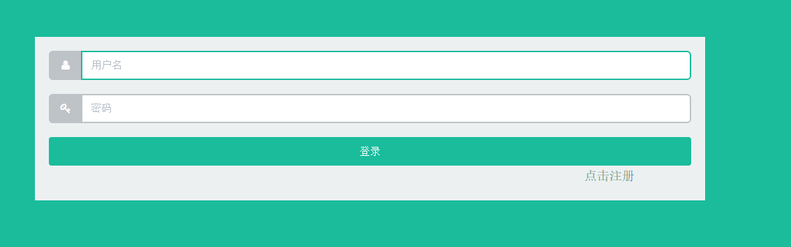
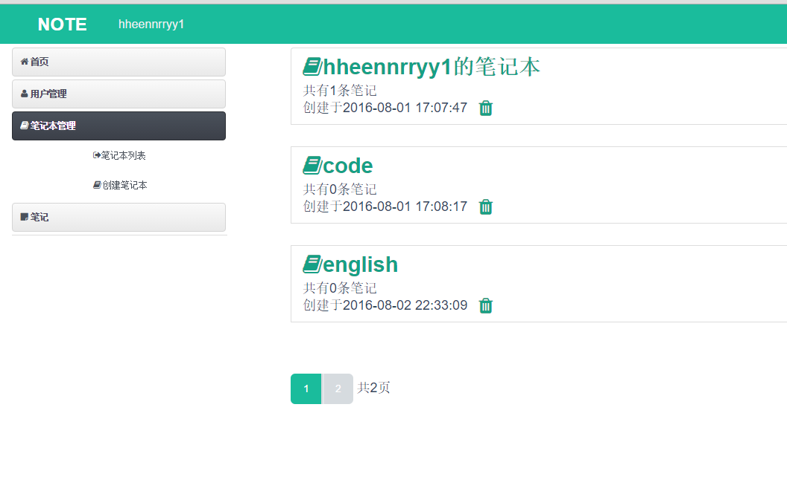
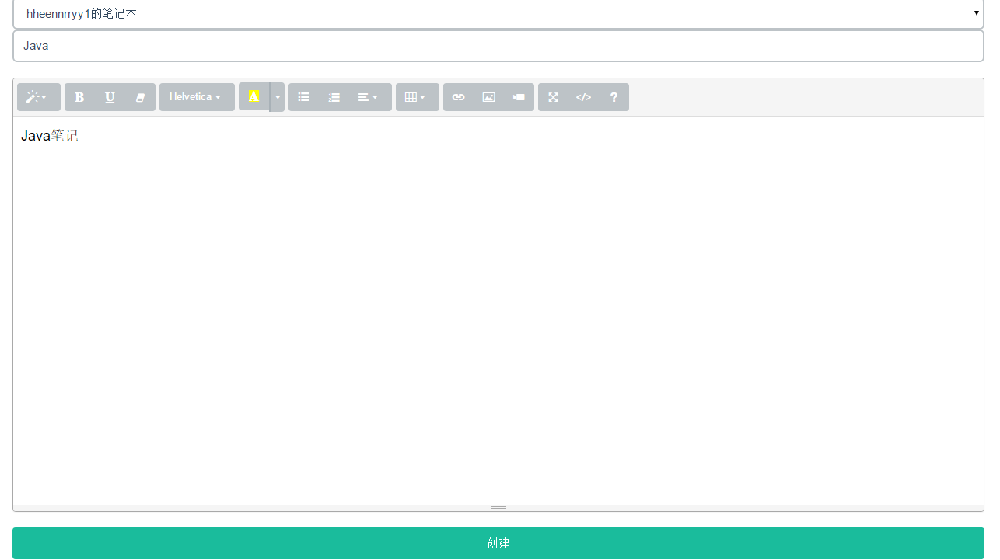

##Note 笔记系统
###Framework and Tools 框架和工具
* Java&IDE: JDK8 Eclipse
* Backend: SpringMVC4.2.5 Spring4.2.5 MyBatis3.4.0 (Configured by annotation)
* Frontend: Bootstrap Bootstrap-validator jQuery jshashes Flat-UI Font-Awesome 
* Database: MySQL5.6
* Web Server: Tomcat 8
* Build Tool: Maven
* Other: Druid(database connection pool) JUnit Log4j Jackson

###System Features 系统特性
* Integration(整合) of Spring core, Spring MVC, and MyBatis
* Management of notebooks and notes through CRUD interface 管理笔记本、笔记，实现增删改查
* Management of user 用户管理包括登录(log in)、注册(sign up)、修改密码(change password)、登出(Log out)

###Demo 截图
Log in 登录     
    
Management of notebooks 笔记本管理    
    
Create note 创建笔记    
    

